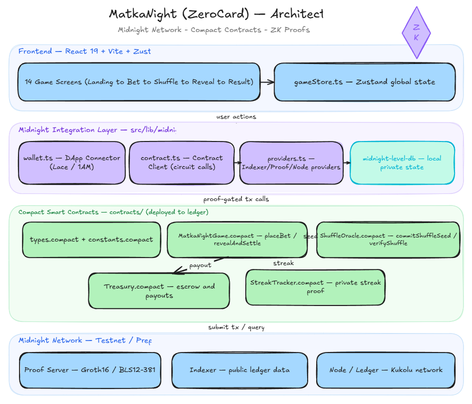

# MatkaNight (ZeroCard)

A card prediction game built on the **Midnight Network**, using Compact smart contracts for bet commit-and-settle on-chain.

This project is built on the Midnight Network.



> See [How to embed the image](#embedding-the-architecture-diagram) below if the image above doesn't render yet.

## Overview

Players pick a betting zone, place a bet, and draw a card to see if they win. Bet commitments and payouts are settled through Compact smart contracts deployed on the Midnight ledger.

**What works today:**

- Wallet connection via the Midnight DApp Connector API
- Placing bets that commit a hash to the on-chain ledger
- Card draw and win/loss evaluation
- On-chain payout settlement (caller supplies the payout amount)

**Known limitations (not yet implemented):**

- Bet amounts are disclosed on-chain during `placeBet` — they are not private
- Card randomness uses `Math.random()` client-side, not a cryptographically secure source
- Payout calculation happens off-chain; `revealAndSettle` accepts a caller-supplied payout rather than deriving it from verified on-chain game logic
- The shuffle verification circuit (`ShuffleOracle.compact`) and win-streak tracker (`StreakTracker.compact`) are not yet integrated into the live game

## Tech Stack

- **Frontend:** React 19, Vite, TypeScript, Zustand, Tailwind CSS, Framer Motion / GSAP
- **Blockchain:** Midnight Network — Compact smart contracts, Groth16 proofs over BLS12-381
- **Wallet:** Midnight DApp Connector API (Lace / 1AM wallet)
- **Local storage:** LevelDB (private state provider, browser-local)

## Project Structure

```
MatkaNight_/
├── contracts/              # Compact smart contracts + deploy tooling
│   ├── types.compact           # Shared enums/structs (Card, ZoneId, Bet)
│   ├── constants.compact       # MIN_BET, MAX_BET, payout rates
│   ├── MatkaNightGame.compact  # Core game logic (placeBet, revealAndSettle)
│   ├── ShuffleOracle.compact   # (WIP) Shuffle seed commitment and verification
│   ├── Treasury.compact        # House bankroll custody, escrow, payouts
│   ├── StreakTracker.compact   # (WIP) Win-streak tracking
│   └── deploy.ts                # Multi-network deploy script
├── dist_contracts/         # Compiled contract output
├── public/artifacts/       # Compiled Compact circuit artifacts
├── midnight-level-db/      # Local private-state store (LevelDB)
├── src/
│   ├── screens/             # 14 game screens (Landing → Bet → Shuffle → Reveal → Result)
│   ├── store/                # gameStore.ts — Zustand global state
│   ├── lib/midnight/         # wallet.ts, providers.ts, contract.ts, types.ts, format.ts
│   ├── components/           # Shared UI components
│   └── assets/               # Fonts, icons, images
├── architecture_image/     # Excalidraw architecture diagram
├── package.json
└── vite.config.ts
```

## Smart Contracts

| Contract | Purpose | Status |
|---|---|---|
| `types.compact` | Shared enums and structs used across the game | Live |
| `constants.compact` | Global rules — min/max bet, per-zone payout rates | Live |
| `MatkaNightGame.compact` | `placeBet` commits a hashed bet to the ledger; `revealAndSettle` verifies it against the commitment and settles payouts | Live |
| `ShuffleOracle.compact` | Shuffle seed commitment and verification | WIP — not called from frontend |
| `Treasury.compact` | Escrows the house bankroll and executes payouts | Live |
| `StreakTracker.compact` | Win-streak tracking per player | WIP — not called from frontend |

## Getting Started

```bash
# install dependencies
npm install

# run the frontend locally
npm run dev

# run against the Preprod testnet
npm run dev:preprod

# compile the Compact contracts
npm run compile:contracts

# build for production
npm run build
```

## Deployment

The deploy script supports multiple networks via `DEPLOY_NETWORK`:

| Network | Description |
|---|---|
| `undeployed` | Local Docker devnet (indexer `:8088`, node `:9944`, proof server `:6300`) |
| `preprod` | Public Preprod testnet |
| `preview` | Public Preview testnet |
| `mainnet` | Production |

```bash
# deploy locally
npm run deploy

# deploy to Preprod
npm run deploy:preprod
```

Preprod requires a local proof server running via Docker:

```bash
docker run -p 6300:6300 midnightntwrk/proof-server:latest midnight-proof-server -v
```

## Architecture

The app is organized into four layers:

1. **Frontend** — 14 React screens driven by a single Zustand store
2. **Midnight Integration Layer** (`src/lib/midnight/`) — wallet connection, contract calls, and chain providers, backed by a local LevelDB private-state store
3. **Compact Smart Contracts** — game logic, treasury, and (planned) shuffle oracle and streak tracking, deployed to the Midnight ledger
4. **Midnight Network** — Proof Server, Indexer, and Node

See the diagram at the top of this file for the full flow.
